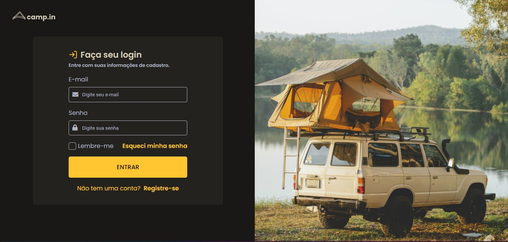

# Camp.in Rocketseat

<div align="center">


</div>

🚀 This repository is a challenge offered by Rocketseat to boost coding front-end abilities, and help beginners to reach the next level.
Rocketseat is a brazilian educational institution of technology, so the page language is pt-br.

# Screenshot
  
[](https://kaiquemcr.github.io/Campin/)

<p align="center">Click on the image above to see in production 👆</p>
  
# the biggest challenge

The biggest challenge for me was styling a custom checkbox design, this took me a few minutes of research and tutorials to do this correctly.

```scss
.container {
  display: block;
  position: relative;
  cursor: pointer;
  padding-left: 25px;

  input {
    position: absolute;
    opacity: 0;
    cursor: pointer;
  }

  input:checked ~ .check {
    background: var(--primary-color);
    border: none;
  }

  .check::after {
    top: 2px;
    left: 6px;
    width: 5px;
    height: 10px;
    border: solid var(--form-background);
    border-radius: 1px;
    border-width: 0 3px 3px 0;
    transform: rotate(45deg);
  }

  input:checked ~ .check::after {
    display: block;
  }
}

.check {
  left: 0;
  top: 3px;
  width: 20px;
  height: 20px;
  background: transparent;
  position: absolute;
  border: solid 1px var(--text-base);
  border-radius: 5px;

  &::after {
    content: '';
    position: absolute;
    display: none;
  }
}
```

# 👾 Technologies

- HTML
- CSS (Sass)
- Javascript

# License

[MIT]("https://choosealicense.com/licenses/mit/")
